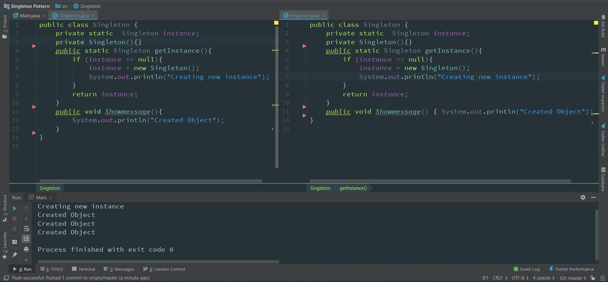

### Pattern Singleton

 Pattern Singleton: > One Class, one Instance.

  Singleton is one of the Gangs of Four Design patterns and comes in the Creational Design Pattern category.
Singleton pattern restricts the instantiation of a class and ensures that only one instance of the class exists in the Java virtual machine. The singleton class must provide a global access point to get the instance of the class. Singleton pattern is used for logging, driver objects, caching and thread pool. Singleton design pattern is also used in other design patterns like __Abstract Factory__, __Builder__, __Prototype__, __Facade__ etc. Singleton design pattern is used in core Java classes also, for example __java.lang.Runtime__ , __java.awt.Desktop__.

### Screenshot of the Full code 


To implement Singleton pattern, there are really many approaches but all of them have following common concepts:

* A private constructor to avoid instantiation of the class,
* A private static variable from the same class that's the only instance of the class.
* public static method that returns the instance of the class, this is the global access point for the outer world to
  get the instance of the class.

We'll implement the thread safe one here. Classes are in the package `com.singleton`;

 ```   
 public class Singleton {
    private static  Singleton instance;
    private Singleton(){}

    public static Singleton getInstance(){
        if (instance == null){
            return instance = new Singleton();
        }
        return instance;
    }
}
```
  
